# content-manager: схемы процессов

Блок-схемы к спеке [`content-manager.md`](content-manager.md) — для проверки логики целиком,
без чтения всего текста. Ссылки вида «§9.4» ведут на разделы спеки.

Формат — **Mermaid**: обычный текст, правится руками, рендерится в GitHub, VS Code
(расширение Markdown Preview Mermaid) и JetBrains. Ромб — решение, прямоугольник — действие,
скруглённый — вопрос админу (диалог останавливается до ответа).

**Легенда цветов**

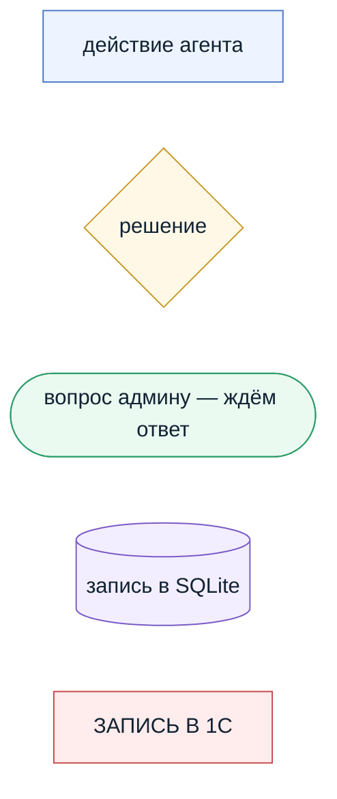

---

## 1. Главный поток: «Проверь новые прайсы»

Соответствует §3. Детали шагов — в схемах 2–7.

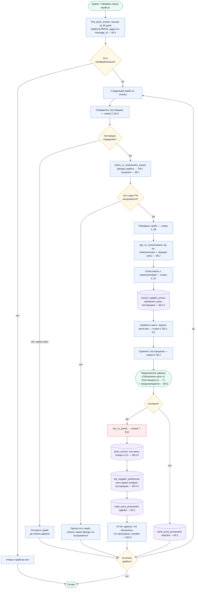

> **Проверить при ревью:** наблюдения цен (`record_supplier_prices`) пишутся **до**
> предложения — то есть и для прайса, который админ потом отклонит (§9.4.1). Это намеренно:
> иначе «у поставщика Б дешевле» неоткуда узнать.

---

## 2. Идентификация поставщика (§4.5)

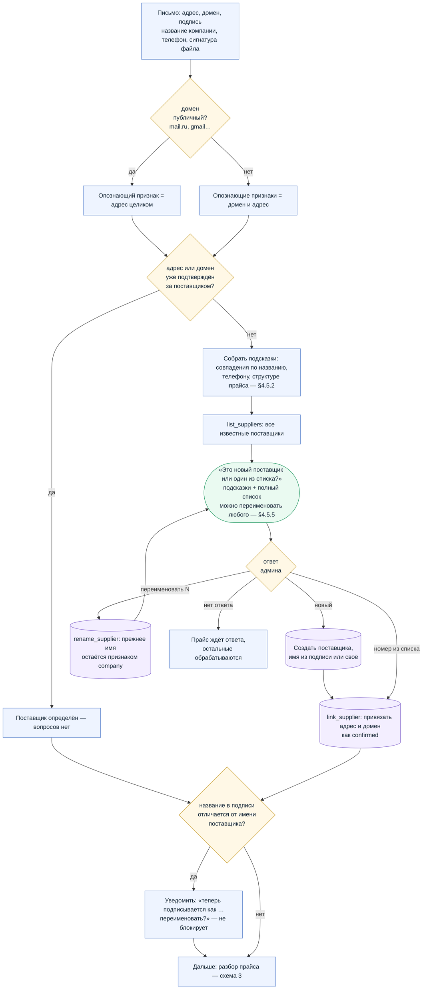

> **Проверить при ревью:** автопривязки и автосоздания нет. Единственная ветка «без вопроса» —
> адрес/домен уже подтверждён админом ранее. Название и телефон никогда не привязывают сами,
> только поднимают кандидата в списке. ИНН не используется (§4.5.1).

---

## 3. Разбор прайса (§6)

```mermaid
flowchart TD
    FILE["Вложение прайса: xlsx / xls / csv / pdf"]:::act
    TABLE["parse_price_table: листы и строки<br/>без обрезки — §6.7"]:::act
    IMG["Найти картинки-баннеры,<br/>вставить маркеры — §6.7"]:::act
    SIG["Вычислить сигнатуру структуры:<br/>листы + шапки, без данных — §6.5.2"]:::act
    MAP{"есть маппинг<br/>supplier_id + сигнатура?"}:::dec

    ASKMAP(["Уточнить: какая колонка = закупка / РРЦ,<br/>цена за штуку или упаковку,<br/>item или collection — §6.5.5"]):::ask
    SAVEMAP[("save_price_mapping")]:::db
    APPLY["Применить маппинг к строкам"]:::act

    BRAND{"в прайсе<br/>несколько брендов?"}:::dec
    BANNER["Проверить баннеры зрением:<br/>есть ли на картинке название бренда — §6.7"]:::act
    SPLIT["Разбить строки по брендам"]:::act

    TYPE["Определить product_type<br/>по разделам и размерам — §6.6"]:::act
    UNIT["Привести цены к базовой ЕИ 1С<br/>по alt_units — §6.3"]:::act
    COEF["Сверить фасовку прайса<br/>с коэффициентами alt_units — §6.3"]:::act
    OUT["Строки прайса: товар, цены, тип, ЕИ"]:::act

    FILE --> TABLE --> IMG --> SIG --> MAP
    MAP -- "нет или неоднозначно" --> ASKMAP --> SAVEMAP --> APPLY
    MAP -- "да" --> APPLY
    APPLY --> BRAND
    BRAND -- "да" --> BANNER --> SPLIT --> TYPE
    BRAND -- "нет" --> TYPE
    TYPE --> UNIT --> COEF --> OUT

    classDef act fill:#eef4ff,stroke:#4a76c7,color:#123
    classDef dec fill:#fff8e6,stroke:#c79a29,color:#123
    classDef ask fill:#eafaf1,stroke:#2f9e6b,color:#123
    classDef db fill:#f3eeff,stroke:#7a5cc7,color:#123
```

> **Проверить при ревью:** наличие картинки само по себе не означает смену бренда — баннер
> проверяется зрением на наличие названия. Расхождения коэффициентов ЕИ не блокируют
> процесс: они уходят в предупреждения отдельной таблицей (§9.3).

---

## 4. Сопоставление с номенклатурой 1С (§7)

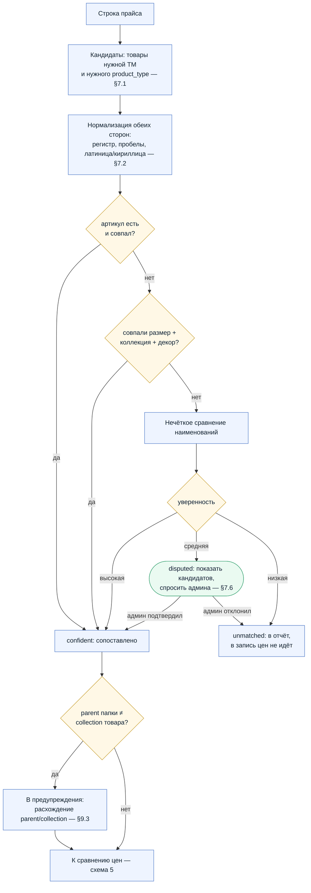

> **Проверить при ревью:** в наблюдения цен (§9.4.1) и в запись попадают **только
> `confident`**. Спорные — после подтверждения админом; `unmatched` не пишутся никуда, кроме
> отчёта.

---

## 5. Сравнение цен и защита регистра (§9.1–9.2)

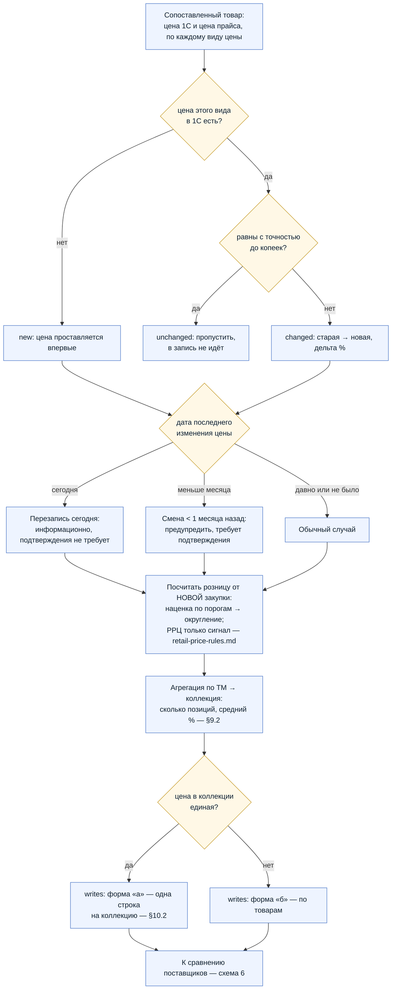

> **Проверить при ревью:** периодичность регистра — ДЕНЬ, поэтому «перезапись сегодня» это
> не порча истории, а замена дневной записи; отдельного подтверждения не требует. А вот смена
> цены в предыдущий день в пределах месяца — требует.

---

## 5а. Расчёт розничной цены

Правила — [`retail-price-rules.md`](retail-price-rules.md). Считается для каждого
сопоставленного товара внутри шага «Посчитать розницу» схемы 5.

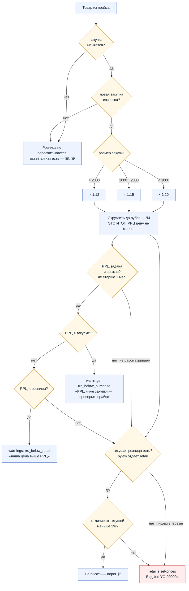

> **Проверить при ревью:** ветка РРЦ идёт **параллельно** записи и на величину цены не
> влияет — обрезки нет, РРЦ только даёт сигнал админу, и только пока она свежая. Триггер
> пересчёта — **только изменение закупки**; обновление одной РРЦ розницу не трогает. Порог
> 2 % — **только для розницы**: закупку и РРЦ пишем при любом отличии, это факты из прайса.

---

## 6. Сравнение поставщиков одной ТМ (§9.4)

Две **независимые** ветки: проверка качества данных по РРЦ и выбор поставщика по закупке.
Пороги §9.4.5 действуют только на вторую.

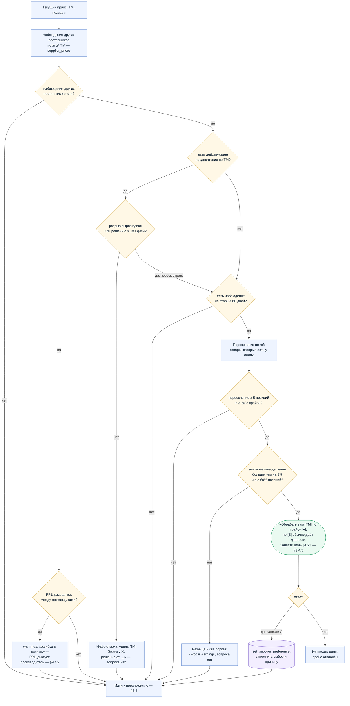

> **Проверить при ревью:** сравнивается только **закупка** и только по **пересечению
> позиций**. Проверка РРЦ идёт **своей веткой** и срабатывает даже когда вопрос о закупке не
> задаётся — иначе при действующем предпочтении ошибка в данных осталась бы незамеченной.
> База наблюдений пуста на старте, поэтому первые месяцы ветка «нет наблюдений» — норма.

---

## 7. Запись цен в 1С (§10)

Левая часть — наша сторона, правая — что делает обработчик 1С
(`specs/1c/set-prices.bsl`).

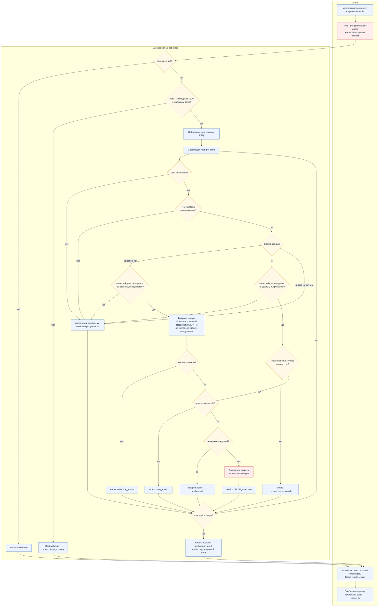

> **Проверить при ревью:** ошибка по позиции не отменяет весь батч — позиция пропускается,
> остальные пишутся. Цена, равная текущей, не переписывается: иначе дата последнего изменения
> в регистре стала бы врать.

---

## 8. Администрирование поставщиков (§4.5.6)

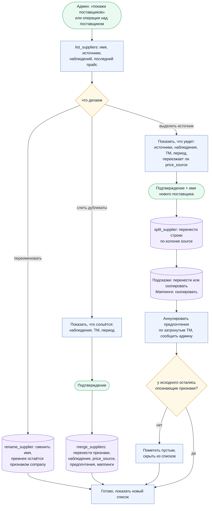

> **Проверить при ревью:** слияние и разделение обратимы друг через друга, потому что каждая
> строка наблюдений помнит свой `source`. Не восстанавливаются только аннулированные
> предпочтения — о них предупреждаем заранее.

---

## 9. Жизненный цикл прайса

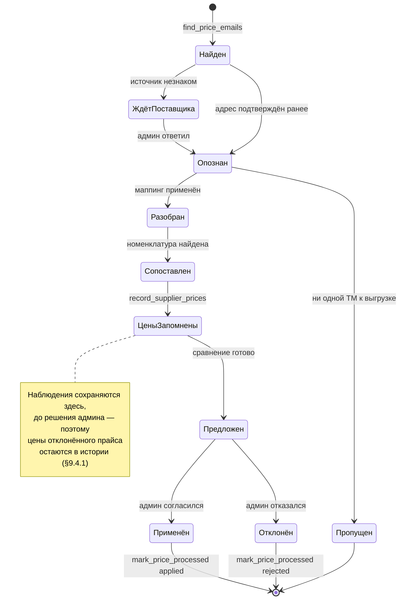

---

## 10. Что где хранится

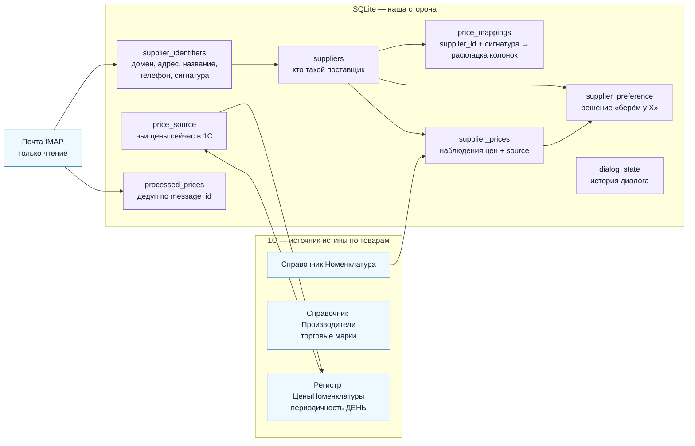

> **Единственная запись в 1С** — цены через `set-prices`. Почта строго read-only. Сущности
> «поставщик» в 1С нет: она существует только у нас.

---

## Где процесс ещё не определён

| Место | Что открыто | Раздел |
|---|---|---|
| Запуск | планировщик отсутствует, только ручная команда | §5.1 |
| Розничная цена | правила расчёта не заданы, в 1С не пишется | §6.4 |
| Коэффициенты ЕИ | расхождения только сообщаются, править в 1С нечем | §17 |
| Условия поставки | `terms` — текст для админа, автоприведения цен нет | §16.6a |
| Наполнение справочника | первые прайсы дадут вопрос про каждого поставщика | §16.6b |
| IMAP | доступ к ящику отключён на тарифе — блокирует §4 | §16.7 |
